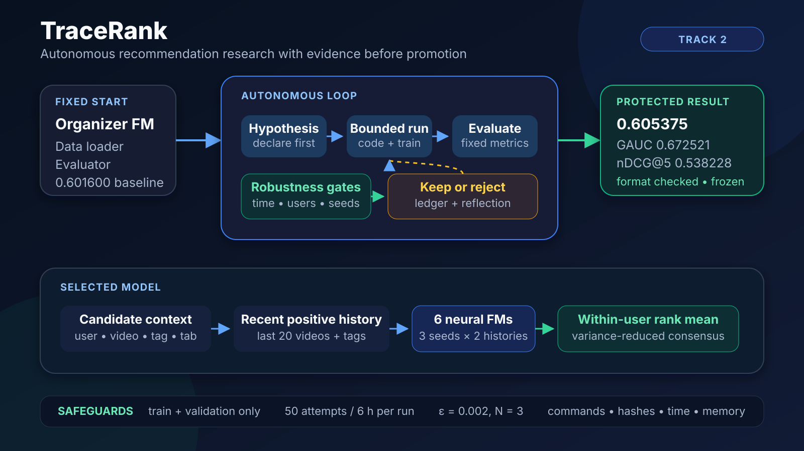
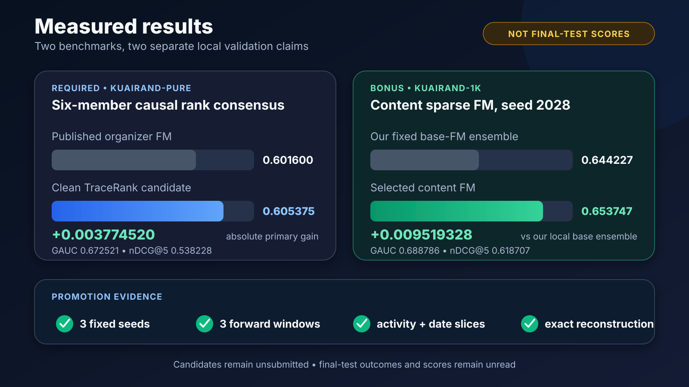

# TikTok TechJam 2026 Track 2 — Autonomous Recommender Research Agent

This repository contains an autonomous, evidence-gated ML research system for
ranking short-video impressions. It begins from the untouched organizer
Factorization Machine (FM), proposes one bounded hypothesis at a time, tests it
on chronological validation windows, rejects fragile gains, and packages only a
candidate that survives the declared gates.

Judged development began after **2026-08-29 12:00 SGT**. This is the sanitized
public release published under explicit user authorization on 2026-08-31 at
<https://github.com/13shreyansh/tiktok-techjam-2026-tracerank>. Datasets,
checkpoints, predictions, generated CSVs, caches, credentials, and private
communications remain excluded. No final-test outcome has been read or scored.



## Verified results

| Benchmark | Validation reference | GAUC | nDCG@5 | Primary |
|---|---|---:|---:|---:|
| KuaiRand-Pure | Published organizer FM | — | — | 0.6016 |
| KuaiRand-Pure | Clean six-member causal-history rank ensemble | 0.672521 | 0.538228 | **0.605375** |
| KuaiRand-1K | Fixed base-FM ensemble | — | — | 0.644227 |
| KuaiRand-1K | Content FM, seed 2028 | 0.688786 | 0.618707 | **0.653747** |
| KuaiRand-27K dev sample | Rank-32 repeat-affinity consensus | 0.706651 | 0.600345 | **0.653498** |

The clean Pure gain is `+0.003774520` over the published validation baseline.
Run83 selected the architecture from chronological validation evidence; Run84
then rebuilt all six members from scratch through the corrected label boundary.
Run85 tested a separate strict-skip history channel and closed after its first
chronological gate produced only `+0.000114977` validation primary with an
activity-dependent trade-off; it was not promoted or tuned further.
Run86 then tested task-protected click auxiliary experts; it closed after a
scored gain of only `+0.000105500`, with GAUC and high-activity regressions.
Run87 tested a chronological LambdaMART residual correction. It appeared strong
on its meta window (`+0.004275059`) but reversed on the untouched target
(`-0.002839923`) and forward (`-0.001916286`) windows, so it was rejected as
temporal overfit without tuning or official application.
Run88 then tested parameter-free majority-pairwise list aggregation. It failed
the early and middle transfer gates and stopped before late or official scoring.
Run89 tested one causal self-attention history encoder; it catastrophically
regressed validation and forward transfer and closed after its opening seed.
Run90 preserved the selected last-20 profile and added a separate last-five
profile. Early validation gained `+0.000557601`, but forward primary slipped
`-0.000009418` and the high-activity slice crossed its frozen loss floor, so
the family closed after one attempt without tuning.
Run91 then isolated earlier likes, follows, comments, and forwards in a
separate candidate-attended profile. Forward primary improved, but validation
regressed and high-activity users crossed the frozen loss floor; it also closed
after one attempt.
Run92 added the single best-matching positive-history item alongside the soft
profile. Validation, forward, medium/high-activity, and late-period gates
failed, so hard target matching closed after one attempt.
Run93 began a fixed seed-saturation audit, but the user froze further model
search for submission after seven successful subprocesses and one pre-model
device failure. It closed before any declared consensus or candidate existed.
The historical best validation reference at `0.605521225` is quarantined, not
submitted. The 1K result is a separate
optional-benchmark result and is not comparable to the
Pure score. The 27K result uses full eligible training data but a fixed 1/32
development evaluation sample, so it is not comparable to either value. None
is a final-test score or a claim about final rank. The 31 August FAQ confirmed
that the supplied test rows are the final judged rows.



## What the system learned

The selected Pure model combines six fully causal neural-FM members. Each member uses user,
video, author, tag, tab, and duration fields plus attention over the user's last
20 positive long-view videos and tags. Scores are converted to percentile ranks
inside each user's candidate list before averaging, aligning the ensemble with
the user-grouped ranking metrics.

On KuaiRand-1K, the strongest transferable change was much simpler: the FM adds
only primary tag, upload type, and video type from the label-free item table.
Causal history, pairwise ranking, extra tags, and richer metadata all failed
their forward-time gates and were rejected. The full negative-result record is
kept because knowing what not to promote is part of the autonomous agent.

On the KuaiRand-27K development sample, the strongest representation connected
each candidate to the same user's strictly earlier interactions with that
creator and video. The protected result averages three rank-32 seeds after
converting each to within-user percentile ranks. Its declared temporal gates
and every official activity/date robustness slice passed.

## Autonomous research loop

1. Preserve and reproduce the organizer baseline and evaluator.
2. Declare one hypothesis, parent, split, and acceptance gate before execution.
3. Screen on chronological shadow validation and a later forward window.
4. Inspect early/late dates and low/medium/high-activity users.
5. Require three fixed seeds before promoting a model family.
6. Log every command, return code, metric, runtime, memory peak, and source hash.
7. Stop at convergence; freeze and checksum the selected artifacts.

The process is adapted from the disciplined experiment-loop ideas in Karpathy
autoresearch, AIDE, and FML-Bench. Pinned source snapshots were preserved during
preparation with URLs, checksums, and licence evidence; their workloads were not
run or represented as the Track 2 solution.

## Quick start

Python 3.9 was used for the verified local run.

For the shortest reviewer path and a clear distinction between clean-clone and
development-machine checks, see
[`docs/JUDGE_QUICKSTART.md`](docs/JUDGE_QUICKSTART.md).

```bash
python3 -m venv .venv
.venv/bin/python -m pip install -r requirements.txt
./scripts/acquire_kuairand_pure.sh
```

Reproduce the untouched organizer FM baseline:

```bash
cd organizer/kuairand-starter-kit
/usr/bin/time -l ../../.venv/bin/python baseline.py \
  --model fm \
  --data_dir ../../data/KuaiRand-Pure/data
```

Audit the tracked release without needing datasets or model outputs:

```bash
.venv/bin/python scripts/release_audit.py
```

On the development machine, verify every ignored protected artifact:

```bash
.venv/bin/python scripts/verify_candidate_artifacts.py
.venv/bin/python scripts/verify_kuairand_1k_artifacts.py
```

Run the fail-closed final local readiness gate (including both CSV alignment
passes, accounting totals, and convergence locks):

```bash
.venv/bin/python scripts/final_readiness.py
```

The selected clean construction, hashes, and compliance gates are in
[`docs/RUN84_REPORT.md`](docs/RUN84_REPORT.md) and
[`experiments/run84/ledger.jsonl`](experiments/run84/ledger.jsonl).
The local CSV passed the label-blind 170,588-row alignment checker.

## KuaiRand-1K bonus package

The checksum-verified 1K archive is acquired with:

```bash
./scripts/acquire_kuairand_1k.sh
```

The selected 1K checkpoint reconstructed all 2,524,980 saved validation
predictions bit-for-bit, then generated 4,132,081 post-April-28 predictions. A
second pass checked exact row alignment without resolving or indexing any
outcome column. No 1K-specific organizer checker or bonus formula is published,
so this remains a local, unsubmitted test-format package. See
[`docs/RUN16_REPORT.md`](docs/RUN16_REPORT.md).

## Evidence map

- Current result and limitations: [`docs/SOLUTION_REPORT.md`](docs/SOLUTION_REPORT.md)
- Five-minute reviewer path: [`docs/JUDGE_QUICKSTART.md`](docs/JUDGE_QUICKSTART.md)
- Clean Pure reconstruction: [`docs/RUN84_REPORT.md`](docs/RUN84_REPORT.md)
- Latest rejected Pure family: [`docs/RUN92_REPORT.md`](docs/RUN92_REPORT.md)
- Historical Pure selection evidence: [`docs/RUN82_REPORT.md`](docs/RUN82_REPORT.md),
  [`docs/RUN83_REPORT.md`](docs/RUN83_REPORT.md)
- 1K campaign and packaging: [`docs/RUN16_REPORT.md`](docs/RUN16_REPORT.md)
- Current protected 27K rank-32 consensus: [`docs/RUN52_REPORT.md`](docs/RUN52_REPORT.md)
- Previous lower-memory rank-diverse fallback: [`docs/RUN49_REPORT.md`](docs/RUN49_REPORT.md)
- Full resource and AI accounting: [`docs/RESOURCE_REPORT.md`](docs/RESOURCE_REPORT.md)
- Human/AI disclosure snapshot: [`docs/DISCLOSURE_SNAPSHOT.md`](docs/DISCLOSURE_SNAPSHOT.md)
- Official-source and contract audit: [`docs/OFFICIAL_STATEMENT_NOTES.md`](docs/OFFICIAL_STATEMENT_NOTES.md)
- Acquisition provenance and licences: [`manifests/`](manifests)
- Immutable campaign evidence: [`experiments/`](experiments)
- Three-minute demo plan: [`docs/DEMO_STORYBOARD.md`](docs/DEMO_STORYBOARD.md)
- System diagram: [`docs/figures/tracerank-system.svg`](docs/figures/tracerank-system.svg)
- Results visual: [`docs/figures/results-summary.svg`](docs/figures/results-summary.svg)
- Devpost-ready narrative packet: [`docs/DEVPOST_PACKET.md`](docs/DEVPOST_PACKET.md)
- Sanitized publication procedure: [`docs/PUBLIC_RELEASE_PROTOCOL.md`](docs/PUBLIC_RELEASE_PROTOCOL.md)

Datasets, caches, checkpoints, predictions, and generated CSVs remain ignored.
The repository commits the code, small ledgers, reports, checksums, and licence
evidence needed to audit how every result was obtained.

## Important limitations

- The final-test score remains unknown; the supplied 29 April–8 May rows are
  now confirmed as the final judged rows.
- The statement contains a stale metric row that conflicts with the starter,
  benchmark table, deliverables, formula, and published scores.
- Run boundaries are not defined. Original Pure Run2 used 37/50 attempts;
  Run82 used 5/50 to freeze the selected all-causal artifact, and Run83 used
  24/50 for independent chronological selection. Through closed Run93, the
  immutable ledgers contain 344 executions across 93 bounded campaign ledgers:
  333 succeeded and 11 failed. Every
  individual campaign remained below 50 attempts and six hours, but the
  cumulative total and undefined restart boundary must be disclosed.
- Run 16 should have stopped at attempt 16. Two later executions were caught,
  disclosed, excluded from eligibility, and did not change the candidate.
- The prior Run2 mixed ensemble contains three members that predate the fully
  causal training-history fix. Run82's fixed all-causal replacement scored
  `0.605521225`; Run83 selected it through a separate, frozen two-of-three
  chronological-window gate. The gain is small and the mixed artifact remains
  preserved as fallback.
- Exact Apple MPS retraining can vary slightly; saved predictions and hashes
  define the protected local candidate.
- Run84 contains one disclosed duplicate seed-2026 execution caused by an
  orchestration polling race. It is counted, preserved, and not an ensemble
  member.
- Run85 used 1/50 attempts and closed at its predeclared first shadow gate; its
  successful negative result did not touch the protected Run84 candidate.
- Run86 used 2/50 attempts: one MPS-sandbox construction failure and one
  successful scored attempt that missed its predeclared materiality gate.
- Run87 used 1/50 attempt and closed when its strong meta-window correction
  failed both the independent target and forward-time transfer gates.
- Run88 used 2/50 successful attempts and closed after two chronological
  majority-pairwise aggregation failures made two-of-three impossible.
- Run89 used 1/50 successful attempt and closed after a catastrophic
  self-attentive history-encoder transfer failure.
- Run90 used 1/50 successful attempt and closed because its small early gain
  did not transfer forward and exceeded the high-activity loss floor.
- Run91 used 1/50 successful attempt and closed because its forward gain did
  not pass validation and exceeded the high-activity loss floor.
- Run92 used 1/50 successful attempt and closed because hard target matching
  failed validation, forward, and three robustness-slice floors.
- Run93 used 8/50 executions and closed at the user's submission freeze before
  its seed consensus was complete; it produced no scored candidate.

See [`PREPARATION_STATUS.md`](PREPARATION_STATUS.md) for the complete ready and
blocked inventory.
